# Mini_Project-Basic-Linux-Commands

## This implementation focuses on hands-on practice with basic Linux commands.
### The basic tools used for this project are:
- GitBash
- GitHub and
- Visual Studeo code as well as Markdown for documentation

## Below are the screenshots demonstrating various basic commands:

### Manipulating files and Directories on Linux
- The `sudo` command: `sudo` stand for `superuser do,` and it allows you to run commands with the security privileges of another user, typically the superuser or `root`.

### 1. Creating a folder with `sudo`
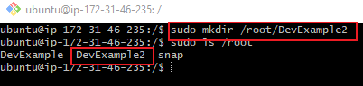

## pwd Command: Used to find the path of your current working directory

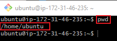

Linux Directory Structure

The Root Directory `("/")`

At the top of the Linux filesystem hierarchy is the root directory, denoted by a single slash `/`. Unlike Windows, which uses different drives `(C:, D:, etc.)`, Linux organizes everything starting from this root directory. Under `/`, you'll find various directories with specific purposes:

- `/bin`: Essential user command binaries (programs) that need to be available to all users are stored here (e.g., ls, cp).
- `/etc`: Configuration files for the system can be found in here.
- `/home`: Personal directories for users.
- `/root`: The home directory for the root user.
- `/var`: Variable data like logs.
- `/usr`: Secondary hierarchy for user data; contains majority of user utilities and applications.

### 2. `cd` Command: Used to navigate through the Linux files and directories.

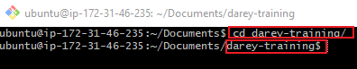

### To list the files and directories on the root file system

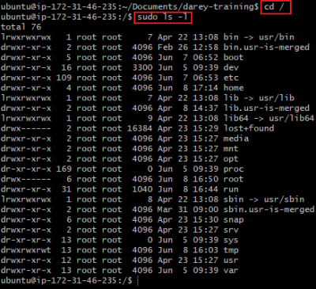

## My Side Hustle Task 1:
1. Create a directory called `photos` inside the `usr` directory

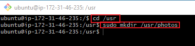

2. Navigate into the `photos` directory

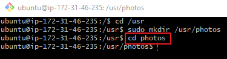

3. Create 3 more random directories inside the `photos` directory

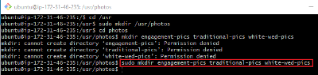

4. Show the newly created directories on the terminal

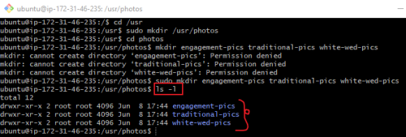

5. Navigate into one of them

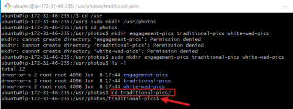

6. Show the full path where you currently are on the screen

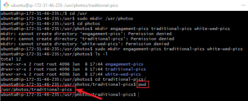

### `ls` Command: Used to list files and directories
To view files in the Document Directory
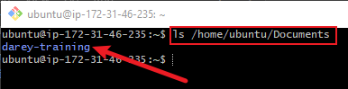

### Some options that can be used with the `ls` command
- `ls -R` Lists all the files in the subdirectories.

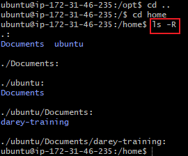

- `ls -a` shows hidden files in addition to the visible ones.

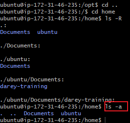

- `ls -lh` shows the file sizes in easily readable formats, such as MB, GB, and TB.

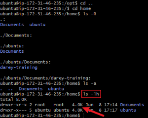

### `cat` Command: `Concatenate`, or `cat`, is used to list, combine and write file content to the standard output.

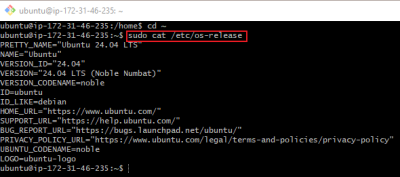

Display the content of `os-release` file in the `/etc/` directory

### `cp` Command: Used to copy files or directories and their content.

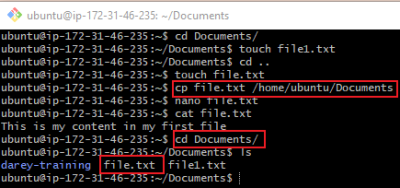

### `cp` Command: To copy the content of a file to a new file in the same directory

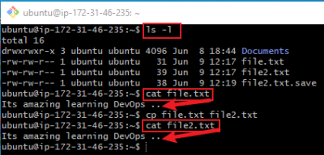

### `mv` Command: used to rename file

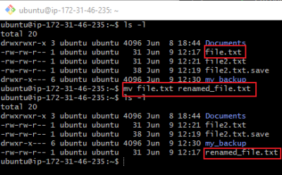

### `rm` Command: Used to delete files within a directory.

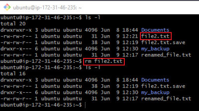

### `rm -i` Command: prompts system confirmation before deleting a file - (Denotes "interactive").

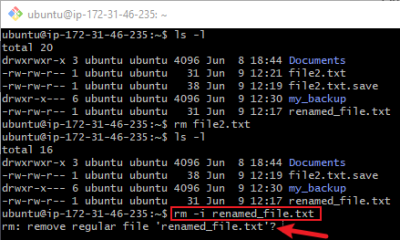

### `rm -f` Command: allows the system to remove without a confirmation - Denotes "force".

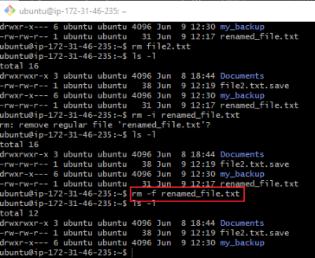

### `rm -r` Command: deletes files and directories recursively.

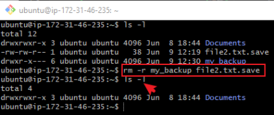

### `touch` Command: allows you to create an empty file.

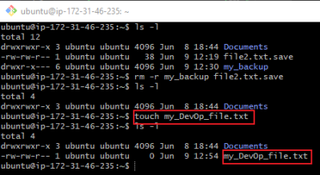

### `find` Command: Used to search for files within a specific directory and perform subsequent operations

## Conclusion:

### The above implementation demonstrates my application of basic Linux commands. With these skills, I am confident I will advance to proficiency.